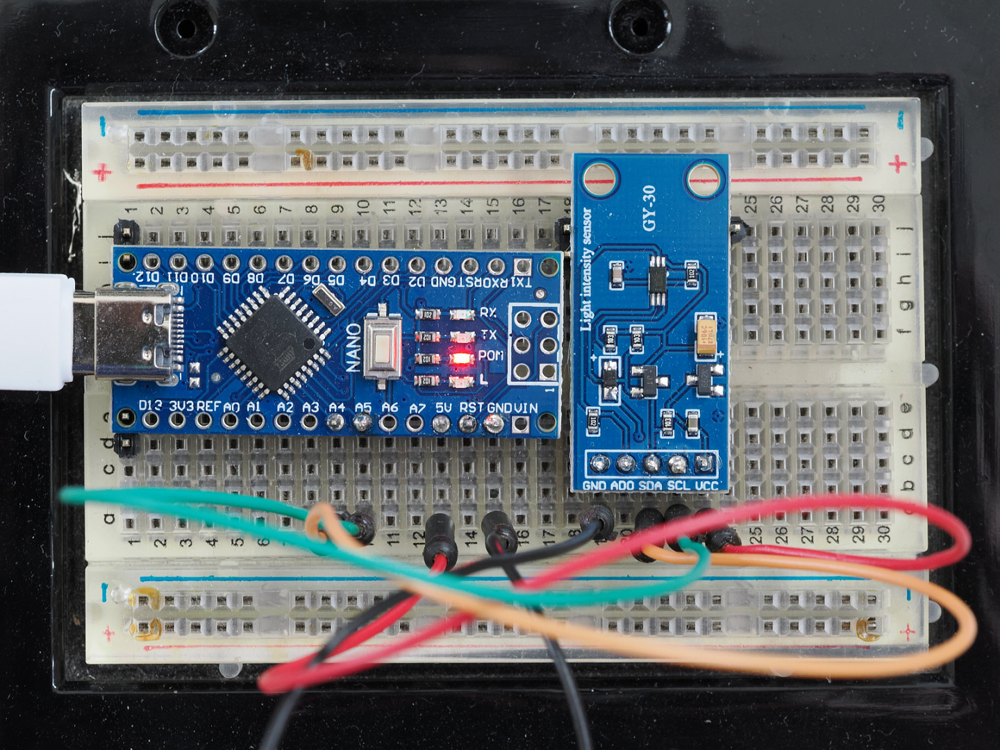

Lux metering - sample scripts
=============================

As of v1.10 `vdu_controls` supports hardware light/lux metering for
automatic brightness adjustment. 

In order to support a variety of
light metering hardware, v1.10 can read metered
values from tty's, named-pipes (FIFO's) and executable programs/scripts.
I currently use a simple light meter built using an __Arduino__ and 
a __GY30/BH1750__ sensor.  I've also written a couple of example scripts 
that uses a __Logitech Webcam C270__ to achieve an approximate metering value.

Introduction
------------

The `Vdu_controls` `Light Meter Dialog` includes controls for setting
up a light meter, setting the brightness auto-adjustment interval, and
defining each VDU's mapping of lux values to VDU brightness:


(Note: the `Light Meter Dialog` is only available after enabling `lux-options` in
the main `Settings Dialog`)

This document discusses some hardware options for lux metering.


GY30/BH1750 + Arduino Lux metering
----------------------------------

An Arduino and a GY30/BH1750 is the very reliable way of obtaining
true Lux values.  At the time of writing, the Arduino Nano and a 
GY30/BH1750 can be purchased for about US$10.  

The image below shows a [Arduino nano](https://en.wikipedia.org/wiki/Arduino_Nano), 
the [GY-30/BH1750](https://github.com/claws/BH1750#bh1750) and the
required wiring connections: 



The components I purchased required the headers to be added
by soldering. If you're not comfortable soldering components, 
the Nano, and possibly the GY-30, may be obtained with the 
headers pre-fitted, in which case assembly on a solderless 
breadboard would be extremely easy.  Power and tty communication 
is via the USB connection to the PC.

A simple [_Arduino Sketch_](https://docs.arduino.cc/learn/programming/sketches)  using 
[Christopher Laws' BH1750 library](https://github.com/claws/BH1750) 
will allow a GY30/BH1750 equipped Arduino to produce a feed 
of Lux values. The sketch code I'm using is as follows:

```
#include <BH1750.h>
#include <Wire.h>

BH1750 lightMeter;

void setup() {
…  // Serial.println(F("BH1750 Lux values stream..."));
}

void loop() {
  float lux = lightMeter.readLightLevel();
  Serial.println(lux);
  delay(1000);
}
```

This sketch produces a feed of Lux values to the Nano's USB tty
output. On a Linux host, the corresponding input tty device 
would typically be `/dev/ttyUSB0`, `/dev/ttyUSB1`, ...  

The permissions on the Linux system may need to be configured to allow
the desktop user access to the USB tty device.  On many systems this 
would mean adding the desktop user's username to an appropriate group. 
The `ls` command can be used to see what user and group owns the device:

```
% ls -l /dev/ttyUSB0                                                                              1 ↵  10269  08:45:34
crw-rw---- 1 root dialout 188, 0 Apr  7 07:32 /dev/ttyUSB0
```

The above example is from my OpenSUSE system, which assigns
these devices to the `dialout` group.  In my case, I'd needed to do:

```
sudo usermod --append --groups dialout michael
```

This grants access to all ``dialout`` devices (all ttys and modems) - which 
may have other security implications.  After adding a user to a group, 
the user will have to re-login - it's the easiest way to ensure the 
whole desktop session hierarchy takes on the change.

Once the sketch is running and the permissions have been set up, the tty 
feed can be directly read by ``vdu_controls``, just configure the correct 
device path in the ``Light Metering Dialog``. 

Manual exposure webcam approximate Lux metering
-----------------------------------------------

If you don't wish to build an Arduino based solution, you 
may be able to use a webcam to achieve usable metering values. 

I've developed two scripts that can uses a webcam frame grab
to calculate a lux-like value:  

 * [**lux-from-webcam.bash**](/sample-scripts/lux-from-webcam.bash):  This bash 
     script averages a webcam capture by using ImageMagick to convert 
     it to a 1 pixel image.  
     **Dependencies**: ``ImageMagick-7`` (image conversion software),
     and ``v4l-utils`` (Video 4 Linux camera controls).

 * [**lux-from-webcam.py**](/sample-scripts/lux-from-webcam.py):  Averages 
     a webcam capture using OpenCV, otherwise
     it's pretty much the same as the bash script.  
     **Dependencies**: ``cv2``(`OpenCV` python real-time computer vision library).

Both scripts are intended for use with webcams that feature manual 
exposure controls. Sampling from fixed manual exposures allows relative
brightness to be measured by calculating the average brightness in 
captured images. Such an approach will work reliably for any desktop 
where the webcam's view is fixed and the only major change throughout 
the day is the light level.

The average brightness in the images can be used to develop a mapping 
of brightness values to approximate lux values. The mapping need not be 
contiguous, accurate, or realistic, they just need to be produce values 
sufficient for use with ``vdu_controls``.

### How to tell if a webcam has a manual exposure option

When attempting to use these scripts with a webcam, it's first
necessary to find out whether the webcam has any options for manual
exposure and how to configure them.  Both of the scripts are 
set to use options available with a  __Logitech Webcam C270__, the 
scripts, or their associated config file, may need editing to employ 
similar options on other webcams.

The `Video for Linux` command `v4l-ctl --list-ctrls-menu` can be 
used to find out what options a webcam supports, for example, here 
is the output for a Logitech Webcam C270:
```
% v4l2-ctl -d /dev/video0 --list-ctrls-menus                                                         1 ↵  10293  07:56:22

User Controls

                     brightness 0x00980900 (int)    : min=0 max=255 step=1 default=128 value=128
                       contrast 0x00980901 (int)    : min=0 max=255 step=1 default=32 value=32
                     saturation 0x00980902 (int)    : min=0 max=255 step=1 default=32 value=32
        white_balance_automatic 0x0098090c (bool)   : default=1 value=1
                           gain 0x00980913 (int)    : min=0 max=255 step=1 default=0 value=0
           power_line_frequency 0x00980918 (menu)   : min=0 max=2 default=2 value=2 (60 Hz)
                                0: Disabled
                                1: 50 Hz
                                2: 60 Hz
      white_balance_temperature 0x0098091a (int)    : min=0 max=10000 step=10 default=4000 value=4000 flags=inactive
                      sharpness 0x0098091b (int)    : min=0 max=255 step=1 default=24 value=24
         backlight_compensation 0x0098091c (int)    : min=0 max=1 step=1 default=1 value=1

Camera Controls

                  auto_exposure 0x009a0901 (menu)   : min=0 max=3 default=3 value=3 (Aperture Priority Mode)
                                1: Manual Mode
                                3: Aperture Priority Mode
         exposure_time_absolute 0x009a0902 (int)    : min=1 max=10000 step=1 default=166 value=166 flags=inactive
     exposure_dynamic_framerate 0x009a0903 (bool)   : default=0 value=1
```

The Logitech Webcam C270 supports `auto_exposure` manual setting of 
to `1 Manual Mode`.  The camera also supports setting 
the `exposure_time_absolute` to something appropriate for 
sampling brightness in the local environment (on Linux, 
the exposure time is set in units of 1/exposure_time_absolute 
seconds, so 64 would mean 1/64 of a second).

### Customising the scripts

The scripts will require customisation for the local ambient lighting 
conditions and  local camera options.  In order to use them you'll need 
to be comfortable editing and configuring hardware and scripts using the 
command line. The requirements for the two scripts are available on 
all major Linux distributions.

Both scripts are similar in their approach:
1. capture a still image, 
2. compute the average image-brightness for the captured image (0..255), 
3. consult a table of image-brightness to lux mappings, 
4. interpolate (log10) between the matched mapping entries,
5. output a single lux value (typically 0 to 10000 on a log10 scale).

#### Configuring the scripts

They both read the same two config files: 

 * `~/.config/lux-from-webcam.config` - basic parameters. **This file is optional**. 
    Default values:
     ```
     DATA_FILE=~/.config/lux-from-webcam.data
     CAMERA_DEVICE=/dev/video0
     MANUAL_EXPOSURE_OPTION=1
     MANUAL_EXPOSURE_TIME=64
     IMAGE_LOCATION=/tmp/lux-from-webcam.jpg
     ```
 * `~/.config/lux-from-webcam.data` - lux/brightness mappings. This file will be created 
    on the first run. Please edit it according to local conditions. Default values:
    ```
     SUNLIGHT       100000 250
     DAYLIGHT        10000 160
     OVERCAST         1000 110
     SUNRISE_SUNSET    400  50
     DARK_OVERCAST     100  20
     LIVING_ROOM        50   5
     NIGHT               5   0  
    ```
    * In the data above, the name in the 1st column is a comment
    noting the circumstances that might result in the lux value 
    in the 2nd column. This comment field is ignored by the script.
    * The 2nd column is the lux value to output.
    * The 3rd column is the camera image-brightness reading that corresponds
    to the 2nd column lux value.  
 
The data file can have any number of rows of descending values.  The above 
defaults shown are from a mapping for a study with access to a large amount 
of natural daylight.  They're unlikely to be suitable for other situations.
  
You can use either the bash script or the python script, or even switch from one 
to the other.  The bash script is slightly faster.

#### Installing the scripts

In order to use these with ``vdu_controls``, they must be set to be 
executable:

```
chmod u+x lux-from-webcam.bash
chmod U+x lux-from-webcam.py
```

#### Running the scripts

Once they are set to be executable, they will be able to be selected 
as _"Runnable"_ script in the  `Light Metering Dialog`. Then
metering can be enabled, and ``vdu_controls`` will periodically
run the selected script to obtain a single lux values.

They can also be run in a shell to experiment with creating new
mapping values. They both output diagnostics to stderr, for example:

```
% /usr/share/vdu_controls/sample-scripts/lux-from-webcam.bash
INFO: camera-brightness: 129/255
INFO: log10 interpolating 129 over 110..160 to lux 1000..10000
INFO: brightness=129, value=110, lux=1031.81, name=OVERCAST
1031.81
```

#### Options for webcams that lack manual exposure options

If a webcam doesn't support fixed manual exposures, it may still be
possible to write your own heuristics to guess at the available light (the
guess only has to be good enough for use with ``vdu_controls``, the
values need not be perfect).  Such heuristics would likely be very 
specific to local circumstances, I've not explored such an approach 
to any great degree, but possibilities include:

 * The difference between the brightest and darkest pixels may be
   greatest when the light source is quite strong.
 * At different times of the day different parts of a scene may
   be dark or light, for example, the ceiling light may only be
   on during the night.
 * The amount of measured image-noise may increase in poor 
   lighting.

Other options
-------------

You can create your own light metering devices and scripts and
use them with ``vdu_controls``.  The ``Light Metering Dialog`` provides 
three options for utilizing a light meter:

 * A tty device: provide a stream of values separated by carriage-return linefeed.
 * A UNIX FIFO: provide a stream of values separated by linefeed (the normal 
   UNIX line terminator).
 * An executable: provide one value on one linefeed terminated line each time 
   it is run.

A custom light meter need not supply accurate or realistic values. A 
custom meter can produce any useful sequence or set or values in the 
range 0 to 10000. Within this closed system, a "lux" value can mean 
what ever you want it to mean.  The ``Light Metering Dialog`` can be 
used to map the custom measured values to an appropriate brightness 
levels. 

See the  [vdu_controls(1) man page](https://htmlpreview.github.io/?https://raw.githubusercontent.com/digitaltrails/vdu_controls/master/docs/_build/man/vdu_controls.1.html)
for further infor on Lux Metering.

