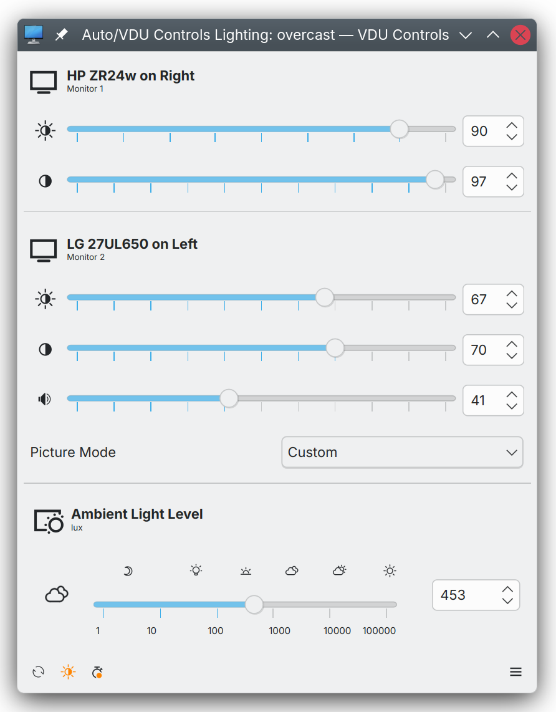
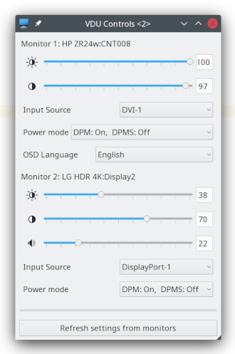
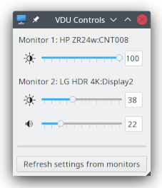
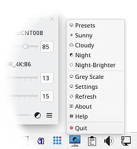
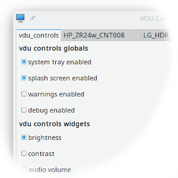
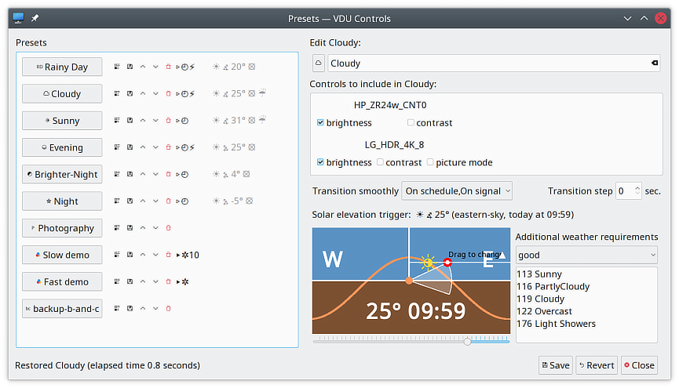
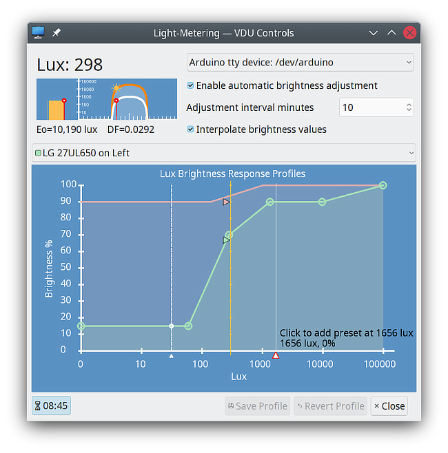

vdu_controls - a DDC control panel for monitors
===============================================

A control panel for external monitors (*Visual Display Units*).

> This is the vdu_controls 2.0 trunk development branch for vdu_controls.  It's
> functional and you're welcome to try it.  
> 
> Version 2.0 adds manual ambient-light-level input.  This allows all connected VDU's
> to be simultatiniously adjusted by moving one slider.  This is an alternative
> to fully automatic control via hardware lux-metering.  When the ambient-light-level
> is changed, each VDU us adjusted according to its own custom light-level/brighness
> profile defined under **Settings->Light-Metering**. This new option is enabled
> by default, but can be disabled by unchecking  **Settings->Lux options enabled**.
>
>   
>
> The second major change in 2.0 is actually far more wide-reaching, but much less visibile.
> The  internal DDC/VDU interface has been rewritten to optionally use the
> D-Bus [ddcutil-service](https://github.com/digitaltrails/ddcutil-service) instead
> of the **ddcutil** command. The new **ddcutil-service** is a daemon I've written to
> interface with **libddcutil**, it's faster and more reponsive than the older
> command-based implementation. Should the ddcutil-service be unavailable,
> the DDC/VDU interface reverts to using the ddcutil command. 
> 
> If you'd like to try the **ddcutil-service**, it's written in C, so you'd
> probably need to build and install it (I do have an RPM for OpenSUSE Tumbleweed).
> It's one C file. It will build against any libddcutil from 1.4 onward.
> It doesn't need to be installed as root, it can also be started
> manually from the command line or installed as a single user D-Bus daemon.
> For install/build details, see:
> 
>    https://github.com/digitaltrails/ddcutil-service
> 
> Unofficial *community* OpenSUSE Tumbleweed RPM:
> 
>    https://software.opensuse.org/package/ddcutil-service
> 
> If the service installed for on demand access via the D-BUS daemon, or if
> ddcutil-service is run manually, a new instance of vdu_controls should automatically 
> start using it and the bottom line of the **About Dialog** will
> list **ddcutil-interface** as **1.0.0 (QtDBus client)**.  Use of the service can
> also be manually toggled via `vdu_controls->Settins->dbus client enabled`.
> 
> You can also access the service from any D-Bus clients such as d-feet or the
> command line tools such as dbus-send and busctl.
> 

Description
-----------

``vdu_controls`` is a virtual control panel for externally connected VDUs.  The application detects 
DVI, DP, HDMI, or USB connected VDUs.  It provides controls for settings such as brightness and contrast.

The application interacts with VDUs via the VESA *Display Data Channel* (*DDC*) *Virtual Control Panel*  (*VCP*) 
commands set.  DDC VCP interactions are mediated by the ``ddcutil`` command line utility.  ``Ddcutil`` provides
a robust interface that is tolerant of the vagaries of the many OEM DDC implementations.

By default ``vdu_controls`` offers a subset of controls including brightness, contrast and audio controls.  Additional
controls can be enabled via the ``Settings`` dialog.  

``vdu_controls`` may optionally run as an entry in the system tray of KDE, Deepin, GNOME, and Xfce (and possibly
others). The UI attempts to adapt to the quirks of the different tray implementations.

Named ``Preset`` configurations can be saved for later recall. For example, a user could create
presets for night, day, photography, movies, and so forth.  Presets may be automatically triggered
according to solar elevation, and can be further constrained by local weather conditions (as
reported by [https://wttr.in](https://wttr.in)). Presets can be set to transition immediately or
gradually.  Presets may also be activated by UNIX signals.

From any application window, use `F1` to access help, and `F10` to access the context-menu.   The 
context menu is also available via the right-mouse button in the main-window, the hamburger-menu item 
on the bottom right of the main window, and the right-mouse button on the system-tray icon. The 
context-menu provides `ALT-key` shortcuts for all menu items (subject to sufficient letters being
available to support all user defined Presets).

_Version 1.10_ introduces options for using lux readings from a hardware lux meter (or in some 
cases a webcam).  When lux metering is enabled, ``vdu_controls`` can vary brightness according 
to customisable  lux/VDU-brightness profiles. See [Lux Metering](./Lux-metering.md) for more details.

The UI's look-and-feel dynamically adjusts to the desktop theme and desktop environment: light-theme,
dark-theme, KDE, Deepin, GNOME, and others.

   
 
 

Getting Started
---------------

To get started with ``vdu_controls``, you only need to download the ``vdu_controls.py`` python script and
check that the dependencies described below are in place.  Alternatively, should you wish to install ``vdu_controls`` 
for all users, RPMs are available for **OpenSUSE**, **Fedora**, and there is an  **archlinux** AUR package
which also works in **Manjaro**.  See the *Install* section below. 

> Development is **trunk-based**.  It is my intention that the trunk should 
> always be usable as a daily-driver.  That being said, a download of trunk is likely to 
> be less stable than downloading one of the formal [releases](https://github.com/digitaltrails/vdu_controls/releases) 
> or installing one of the packages that are available in various distros.

Dependencies
------------

All the following runtime dependencies are likely to be pre-packaged on any modern Linux distribution 
(``vdu_controls`` was originally developed on OpenSUSE Tumbleweed).

* **ddcutil >= 1.2, >= 1.4 recommended**: the command line utility that interfaces to VDUs via DDC over i2c-dev or USB. (If 
  anyone requires support for versions of ddcutil prior to v1.2 please contact me directly.)
* **i2c-dev**: the i2c-dev kernel module normally shipped with all Linux distributions and required by [ddcutil](https://www.ddcutil.com)
* **python >=3.8**: ``vdu_controls`` is written in python and may depend on some features present only in 3.8 onward.
* **python >=3.8 QtPy**: the python GUI library used by ``vdu_controls``.

It's best to confirm that ``ddcutil`` is functioning before using ``vdu_controls``:

* See [https://www.ddcutil.com/config/](https://www.ddcutil.com/config/) for instructions on configuring ``ddcutil``
  (including some extra steps for Nvidia GPU users).
* See [https://www.ddcutil.com/i2c_permissions/](https://www.ddcutil.com/i2c_permissions/) for instructions on setting 
  and testing the required permissions.  
* Fo some VUDs, DDC/CI over Display-Port to Display-Port connections may work when others 
  connections don't (mainly with some Nvidia GPUs).

As of ddcutil 1.4, installing a pre-packaged ddcutil will most likely set the correct udev rules to 
grant users access to the required devices.  If you are using an earlier ddcutil, it may be necessary to follow 
all the steps detailed in the links above.  

Installing
----------

As previously stated, the ``vdu_vontrols.py`` script is only file required beyond the prerequisites. There
are also **OpenSUSE** and **Fedora** RPMs available at: [https://software.opensuse.org/package/vdu_controls](https://software.opensuse.org/package/vdu_controls)
and an **archlinux** (**manjaro** compatible) **AUR** package at: [https://aur.archlinux.org/packages/vdu_controls](https://aur.archlinux.org/packages/vdu_controls)


That makes three options for "installation": 

1. The script can be run without installation by using a python interpreter, for example:
   ```
   % python3 vdu_controls.py
   ```
2. The script can be self installed as desktop application in the current user's desktop menu 
   as *Applications->Settings->VDU Controls* by running:
   ```
    % python3 vdu_controls.py --install
   ```
      Depending on which desktop you're running menu changes may require logout before they become visible.
3. A system-wide installation using a distribution's packaging system which will install all of:

   ```
   /usr/bin/vdu_controls
   /usr/share/applications/vdu_controls.desktop
   /usr/share/licenses/vdu_controls/LICENSE.md
   /usr/share/vdu_controls/icons/*
   /usr/share/vdu_controls/sample-scripts/*
   /usr/share/vdu_controls/translations/*
   /usr/share/man/man1/vdu_controls.1.gz
   ```

Please note the first two options only install ``vdu-controls`` for the current user.  The script and desktop-file 
installed for a single user could be modified and copied into /usr or /usr/local hierarchies should you 
wish to do so.  If using the first two options, you might want to follow up by manually downloading
some of the other items such as the [starter set of icons](icons) for use when creating Presets.

Executing the program
---------------------

* If installed from rpm, **VDU Controls** should be in everyone's application menu under **Settings**. 
  The ``vdu_controls`` command will also be in everyone's ``PATH`` and will be able to be run from the command
  line, for example:
     ```
     % vdu_controls --show brightness --show contrast --show audio-volume
     ```
* If installed by the current user via the ``--install`` option, **VDU Controls** should be in
  the current user's application menu under **Settings**. The ``vdu_controls`` command will be in ``$HOME/bin``.
  If ``$HOME/bin`` is on the user's ``PATH``, ``vdu_controls`` will be also able to be run from the command
  line in the same manner as above.
* If the script has not been installed, it can still be run on the command line via the python interpreter, 
  for example:\
  ``% python3 vdu_controls.py --no-splash --system-tray --show brightness --show contrast``

Help
----

Detailed help can be accessed by using the right mouse-button to bring up a context-menu.  Access to the context-menu
is available in the application-window and in the system-tray icon.

Both brief help and detailed help can also be accessed via the command line:
```
% python3 vdu_controls.py --help
% python3 vdu_controls.py --detailed-help
% python3 vdu_controls.py --detailed-help | pandoc --from markdown --to html > vdu_controls_help.html
# or if installed as an executable:
% vdu_controls --help
% vdu_controls --detailed-help
% vdu_controls --detailed-help | pandoc --from markdown --to html > vdu_controls_help.html
```

Whether run from the desktop application-menu or run from the command line, ``vdu-controls`` behaviour can be altered
in a number of ways:

* The `Settings` item in the context-menu.
* Command line options.
* Configurations files in `$HOME/.config/vdu_controls/`

See the context-menu or the  [man page](https://htmlpreview.github.io/?https://raw.githubusercontent.com/digitaltrails/vdu_controls/master/docs/_build/man/vdu_controls.1.html)
 for details.

VDU controls and optimisations can be specified in the global or VDU-specific config-files.

Bugs and Suggestions
--------------------
If you encounter a bug or issue, or wish to make a suggestion, you're most welcome to raise 
it on the [issues page](https://github.com/digitaltrails/vdu_controls/issues).

Development
-----------

I've set up the ``vdu_controls`` source as a typical Python development, but there is only one real source
file, ``vdu_controls.py``, so the file hierarchy is rather over the top.  A standard python distributable 
can be built by issuing the following commands at the top of the project hierarchy:
```
% python3 -m pip install build
% python3 -m build
...
% ls -1 dist/
total 268
vdu_controls_digitaltrails-1.0.0-py3-none-any.whl
vdu_controls-digitaltrails-1.0.0.tar.gz
```

The source includes configuration files for the 
[Sphinx Python Documentation Generator](https://www.sphinx-doc.org/en/master/index.html). 
The following commands will extract documentation from ``vdu_controls.py``:
```
% cd docs
% make man
% make html
```
I prefer [Pandoc](https://pandoc.org/)'s HTML generation. There is a util script that generates the
Sphinx outputs and then pandoc for the html:
```
% ./util/make-man
```

My IDE for this project is [PyCharm Community Edition](https://www.jetbrains.com/pycharm/).

Coverage testing is assisted by [Coverage.py](https://coverage.readthedocs.io/) and [Vulture](https://pypi.org/project/vulture/).
Type checking is assisted by [Mypy](https://mypy.readthedocs.io/).

My development Linux desktop is [OpenSUSE Tumbleweed](https://get.opensuse.org/tumbleweed/). The python3
interpreter and python3 libraries are from the standard Tumbleweed repositories. 

Acknowledgements
----------------

* Sanford Rockowitz ([rockowitz](https://github.com/rockowitz)), for the robust [ddcutil](https://github.com/rockowitz/ddcutil) utility and all the friendly help and assistance.
* Mark Wagie ([yochananmarqos](https://github.com/yochananmarqos)), for Gnome related suggestions and AUR port.
* Denilson Sá Maia ([denilsonsa](https://github.com/denilsonsa)), for many suggestions, assistance, and contributions.
* Matthew Coleman ([crashmatt](https://github.com/crashmatt)), Mark Lowne ([lowne](https://github.com/lowne)), [usr3](https://github.com/usr3), for 
  contributing fixes to code and documentation.
* [Jakeler](https://github.com/Jakeler), [kupiqu](https://github.com/kupiqu), Mateo Bohorquez ([Milor123](https://github.com/Milor123)), Johan Grande ([nahoj](https://github.com/nahoj)), 
  [0xCUBE](https://github.com/0xCUB3), [RokeJulianLockhart](https://github.com/RokeJulianLockhart), [abil76](https://github.com/abil76) 
  for contributing suggestions for enhancements. 
* Malcolm Lewis ([malcolmlewis](https://github.com/malcolmlewis)) for assistance with the OpenSUSE Open Build Service submissions.
* Christopher Laws ([claws](https://github.com/claws)) for the [BH1750 library](https://github.com/claws/BH1750) 
  and [example build](https://github.com/claws/BH1750#example) (lux-metering).
* Plus others who have supplied feedback and suggestions.

Author
------

Michael Hamilton

Version History
---------------

* 2.0.0
  * Added an optional D-Bus interface to ddcutil for up 10x faster response times.
  * Added an immediate-lighting-check button and corresponding context-menu item (when lux-metering is enabled).
  * Added an ambient-light-control for manual lux input, one slider to adjust brightness on all displays.
  * Added more preset icons.

* 1.20.0
  * Added options monochrome-tray and mono-light-tray to enable a monochrome tray-icon (dark and light).
  * Optional $HOME/.config/vdu_controls/tray_icon.svg overrides the normal tray icon.
  * Improved the adjustment of icon/window dimensions by scaling them in respect to the user's default-font height.
  * Remove adjust-for-dpi in favour of the the above which automatically accounts for DPI.
  * When a Preset is transitioning slowly (i.e. not immediately), the UI controls can be used to stop the transition.
  * Considerable internal refactoring of option handling.

* 1.12.0
  * Added an F10_key context menu shortcut to all application windows (KDE accessibility standard).
  * Set icon and pixmap sizes appropriately for Normal and High DPI (controlled by adjust-for-dpi) (issue #63).
  * Icon/device-chooser-dialog: init-time reduced from 30 to 5 seconds for users with large home folders (issue #61).
  * Improvements/Fixes to the vlux_meter.py sample-script and the related vdu_controls FIFO reader.
  * Improved visibility of the app-icon's preset-transitioning indicator and auto-lux indicator.
  * Increased contrast for generated text preset-abbreviation icons.
  * Encode translations in plain text rather than escaped XML (for easier editing).

* 1.11.1
  * Fix Preset text size in tray icon.
  * Fix occasional concurrency lockup issue in lux_metering.
  * Update the Settings Dialog when a new VDU becomes available.
  * Light-metering: show both a lux-auto indicator (an orange "LED") AND the current preset (if any) in the app icon.
  * Fix first time use crash (issue #60).
  * Allow % in config files by turning off ConfigParser interpolation (issue #60).
* 1.11.0
  * Made vdu_controls ddcutil-2.0-ready.
  * Added support for ddcutil versions earlier than 1.3 (issue #43, #53).
  * Main-Window: added a hide-on-focus-out option to minimize the main window on focus out (issue #57).
  * Main-Window: changed the layout to display brightness and contrast as the first two controls for each VDU.
  * Main-Window: added jump to clicked value to sliders (issue #59).
  * Main-Window: added a smart-main-window option to make main window placement and geometry preservation optional.
  * Main-Window: the main window can now be raised above the other sub-windows (gnome issue only).
  * Main-Window and Context Menu: added alt-key keyboard shortcuts (issue #13).
  * Context-Menu: added an indicator mark suffix to the currently active Preset (if any) (issue #55).
  * Context-Menu: made changes to Preset ordering propagate to the menu without requiring an application restart.
  * Tray-Icon: made the app icon un-themed so that overlaid active Preset text/icon is more visible (issue #55).
  * Settings-Dialog: added a Reset button to makes it possible to un-ignore a VDU (issue #51).
  * Settings-Dialog: added tool-tips to main config-settings, made them consistent with command line help (issue #52).
  * Preset-Dialog: combined the Activate and Edit buttons into one button (simpler and more intuitive).
  * Preset Dialog: made the dialog bold the text button of the currently active Preset (if any).
  * Preset Dialog: added code to detect and and warn of unsaved changes.
  * Preset Dialog: made the dialog lock out any scheduled or automatic VDU changes while a Preset is being edited.
  * Preset-Dialog: supplied a starter set of Prest icons - a selection of KDE breeze5-icons (issue #56).
  * Popup-Messages: made message box popups resizable for increased readability.
  * Command-line: made config-settings and command-line arguments consistent, command line has precedence (issue #52).
  * Command-line: fixed --sleep-multiplier so that it is actually applied (issue #54).
  * Prevented potential crashes in the event of utf-8 decoding errors for EDIDs and capabilities (issue #49).
  * Added logging of stack traces for some errors if debugging is set to on (issue #49).
  * Improved the handling of ddcutil not found (issue #48).
  * Refactored to improve maintainability and run-time efficiency (issue #52).
  * Added Deepin 23 pyqt library compatibility.
  * Numerous minor enhancements and fixes.
  * An alpha release of vlux_meter.py, a system-tray webcam lux-meter, has been included in the sample scripts folder.
* 1.10.2
  * Fix Preset non-zero transition-step-seconds, so it works properly.
  * Changing log-to-syslog or log-debug-enabled no longer requires a restart.
  * Fix Lux Auto menu icon when starting with Auto disabled.
  * Use the progress bar area on the main panel for status messages.
  * Make auto brightness behave more predictably by removing unnecessary constraints on interpolation.
  * Improve auto-lux/preset tray icon interaction - better reflect actions and current state.
* 1.10.1
  * Restore lux meter displayed-value when restoring LuxDialog window.
  * Minor fixes to reduce and improve displayed and logged messages.
  * Rollup release prior to downtime for ToTK
* 1.10.0
  * Added hardware lux metering options (GY30/BH1750+Arduino, UNIX-fifo, or executable-script).
  * Added lux-to-brightness profiles per VDU.
  * Added sample scripts for using a webcam to produce approximate lux values.
  * Added an option to transition smoothly on UNIX signal.
  * Replaced the transition combo-box with a button+checkboxes.
  * Added drag-to-change, click-to-delete, to the elevation chart component.
  * Added a setting to quickly disable weather and another for elevation-scheduling.
  * Cleanup of thread handling - clarification of GUI/non-GUI thread operations.
  * Reduced logging and eliminated popup dialogs when monitors are suspended or powered off.
* 1.9.2
  * Optional _Smooth Transitions_ for presets:
    * The Presets Dialog now includes an option to set a Preset to _Transition Smoothly_.
    * The tray, main panel, and Preset Dialog indicate when a smooth transition is in progress.
    * Transitions are performed by a non-GUI thread, the GUI remains accessible during smooth transitions.
    * A smooth transition can be interrupted by moving the controls being transitioned or invoking a preset.
* 1.9.1
  * The text input to right of slider controls has been replaced with a SpinBox with up/down arrows.
  * The main panel progress-bar spinner will now also display during preset-activation (in addition to displaying during refresh).
  * Refresh and preset controls now lock during refresh and preset-activation (to prevent conflicting actions).
  * The context menu and hamburger menu are now available during refresh (a subset of actions is available, such as help and about).
  * The VDU `EDID` 128/256 byte identifier is now used internally to ensure the controls operate on the correct monitor.
  * Build changes for submission to _OpenSUSE_  _Development_ and _Factory_ by @malcolmlewis.
  * The thread handling and error handling has been cleaned up.
* 1.9.0
  * Bug fixes and speedy performance improvements:
    * Speed up initialization and refresh by combining multiple ddcutil `getvcp` requests.
    * Stop executing a `getvcp` precheck before each `setvcp`. 
    * Fix repeat-initialisation bug in _Context-Menu Refresh_.
    * Fix _Settings Dialog_ text field validation, some errors were invisibly ignored.
    * Fix _Settings Dialog_ _Settings Enable VCP Codes_, they had stopped working.
    * Fix the monitor specific sleep multipliers, they were not always being used.
    * Treat all monitor detection situations as needing time to stabilise (helps in disconnect situations).
    * Fix event handling so that tablet+pen input works on the main window.
    * Default to a sleep-multiplier of 1.0 to support a wider range of monitors out of the box.
  * V1.9.0 drops support for converting from v1.6.* config and preset files. To convert 
    from v1.6.* and earlier versions, follow these steps to download and run v1.8.3:
    ```
     % wget https://github.com/digitaltrails/vdu_controls/blob/v1.8.3/vdu_controls.py
     % python3 vdu_controls.py
    ```
    Alternatively, start fresh by moving or removing the old configs from `$HOME/.config/vdu_controls`.
* 1.8.3
  * Fix for a crash when the network is down and the weather site cannot be contacted. 
* 1.8.2
  * Solar elevation weather requirements.
  * Locale language support and sample AI generated translations.
* 1.8.0
  * Presets can be scheduled to activate according to solar elevation at a given latitude and longitude.
* 1.7.2
  * Better handle monitors being powered off: on set-value errors, check what's connected. 
  * The display ordering of presets can now be manually altered in the Presets dialog.
  * Do not exit if no controllable monitor is found.
* 1.7.1
  * Refactoring in 1.7 broke the signal handling - incorporate fix from Mark Lowne. 
* 1.7.0
  * Presets can now optionally have icons which display in the menu and overlay the tray icon.
  * The Preset-management dialog now includes an icon selection button.
* 1.6.11
  * Display current preset in window and tray title and detect if a preset is in use at startup.
* 1.6.10, 1.6.9
  * Cope better with invalid slider values caused by a monitor being too slow/busy when responding.
  * Wait for monitor detection to stabilise at session restoration (at login time).
* 1.6.8
  * Fix preset restore/save bug introduced in 1.6.7
* 1.6.7
  * Gnome system tray behaviour made consistent with gnome - when in gnome do as the gnomens do.
* 1.6.5
  * Widen handling of pare exceptions for VDU capabilities - catch more exceptions.
* 1.6.4
  * Wait for system tray to become available (for autostart Plasma Wayland).
  * Enable HiDPI icons (for the bottom toolbar) - fix blurred toolbar icons on up-scaled desktops.
* 1.6.3
  * Added a hamburger menu as an obvious alternate path to the context menu.
  * Minor cosmetic UI changes.
* 1.6.2
  * Added a Feature Values: min..max override to optionally restrict brightness and other sliders.
* 1.6.1
  * Alterations for Wayland compatibility (cosmetic)
* 1.6.0
  * Let other processes trigger vdu_controls preset changes and settings refreshes via UNIX/Linux signals.
* 1.5.2
  * ``vdu-controls`` is now feature complete in respect to my own requirements.
  * Raise popup dialogs to the top (in case Qt renders them behind existing windows).
  * Documentation tweaks.
* 1.5.1
  * New grey-scale reference chart for assistance with brightness and contrast adjustment.
  * About/help/settings/presets dialogs are now singletons, only one of each can be visible.
* 1.5.0
  * New presets feature: easily switch between named presets such as *Night*, *Day*, *Overcast*, *Sunny*, 
    *Photography*, and *Video*.
  * ``Presets`` context-menu item for access to the new ``preset management widget``.
  * Context menu shortcuts for quickly accessing presets.
  * INI preset file format for ease of editing.
* 1.4.2
  * Fix increasing indentation of multiline capabilities text on each config file save.
  * Prune the VDU settings-editor control-list to only show controls supported by the VDU.
  * Use grid layout in the ``settings`` editor.
* 1.4.1
  * Internal code cleanups after switching to INI config files (no functional changes).
  * Updated the help.
* 1.4.0
  * Added global and VDU-specific INI style configuration files in `$HOME/.conf/vdu_controls/`.
  * Added a GUI settings-editor as a `settings` menu-item in the context-menu.
* 1.3.1
  * A minor enhancement to ease installation on Ubuntu, create ``$HOME/bin`` if it doesn't exist. 
* 1.3.0
  * Add a CUSTOM::Sleep_Multiplier VDU config-file option to allow VDU specific sleep multipliers.
    This can be used to prevent the slowest VDU from dragging down response time for all connected VDUs.
  * Added a main UI right-mouse action that makes the context menu available in the UI window.
  * Added a help option to context menu, it displays a formatted version of the ``--detailed-help`` text.
  * Added a ``--detailed-help`` command line option to extract the help from the script (in Markdown format).
* 1.2.2
  * Generalise and simplify the error handling changes initiated in v1.2.1.
* 1.2.1
  * Catch ddcutil error exit and offer to try a slower --sleep-multiplier
* 1.2
  * Better handle out of range values.
  * Enable audio-mute,audio-treble,audio-bass,audio-mic-volume.
  * Allow ddcutil to be anywhere on the user's PATH.
  * Improve parsing to ignore laptop non-MCCS displays when present with external monitors. 
  * Improve the documentation.
  * Add an --about command line option and an "about" tray option.
* 1.0
  * Initial Release

License
-------

This project is licensed under the **GNU General Public License Version 3** - see the [LICENSE.md](LICENSE.md) file 
for details

**vdu_controls Copyright (C) 2021 Michael Hamilton**

This program is free software: you can redistribute it and/or modify it
under the terms of the GNU General Public License as published by the
Free Software Foundation, version 3.

This program is distributed in the hope that it will be useful, but
WITHOUT ANY WARRANTY; without even the implied warranty of MERCHANTABILITY
or FITNESS FOR A PARTICULAR PURPOSE. See the GNU General Public License for
more details.

You should have received a copy of the GNU General Public License along
with this program. If not, see <https://www.gnu.org/licenses/>.

