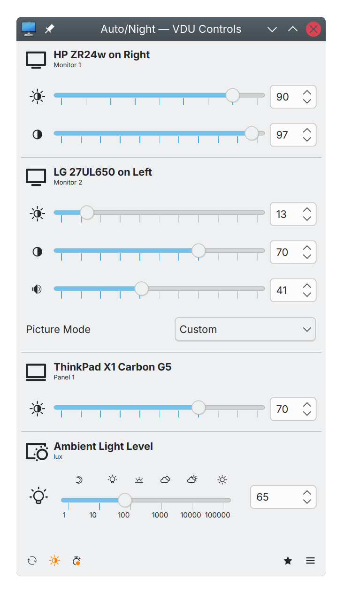
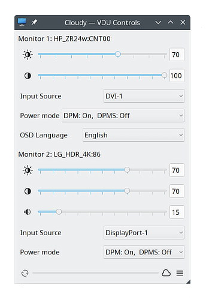
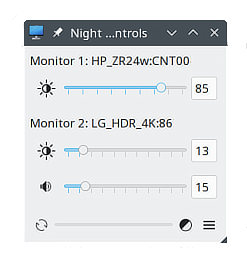
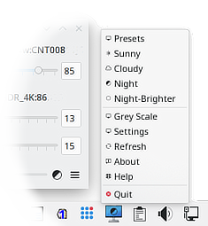
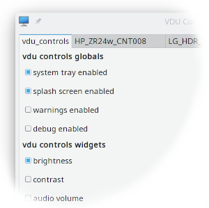
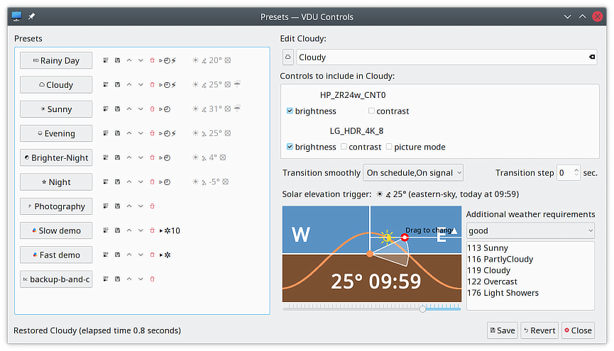
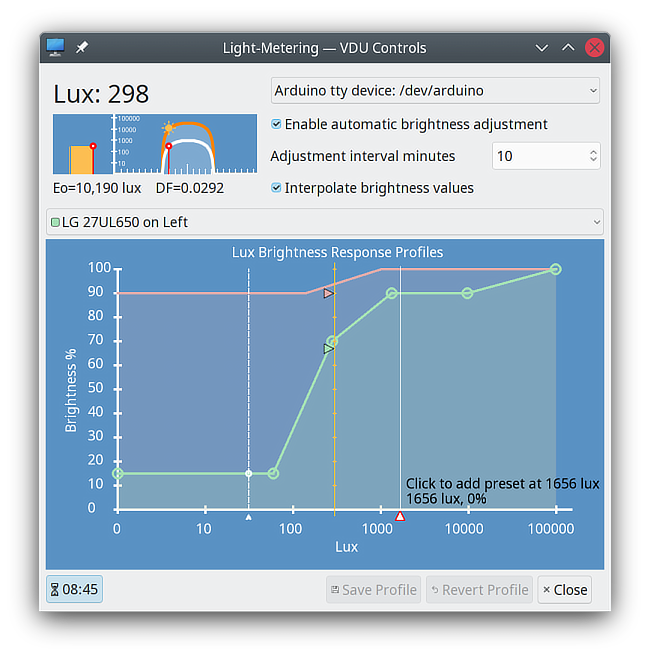

<!-- 
SPDX-FileCopyrightText: 2021-2026 Contributors to vdu_controls <https://github.com/digitaltrails/vdu_controls>
SPDX-License-Identifier: GPL-3.0-or-later
-->

vdu_controls - a DDC control panel for monitors
===============================================

A control panel for external monitors (*Visual Display Units*).

> __[Preview 2.6.5-rc.3 is available](https://github.com/digitaltrails/vdu_controls/releases/tag/v2.6.5-rc3).__
> 

<!-- mkdocs-exclude-start -->

> [!TIP]
> New documentation site is [https://digitaltrails.github.io/vdu_controls/](https://digitaltrails.github.io/vdu_controls/)

<!-- mkdocs-exclude-end -->


> [!TIP]
> Laptop-panels are supported in version 2.6 (see [options](https://github.com/digitaltrails/vdu_controls#laptop-panel-brightness-controls) below).


## Description



``vdu_controls`` is a virtual control panel for external Visual Display Units 
(VDUs, monitors, displays). It supports displays connected via DisplayPort, 
DVI, HDMI, USB, and built-in laptop-panels (laptop-panel integration
is provided by ``brightnessctrl`` for brightness only).

Controls include brightness, 
contrast, and audio - with additional options available in the 
*Settings-Dialog*.

A single **ambient-light-level slider** can simultaneously
adjust _all_ displays, each following its own custom profile:
_one slider to rule them all_.  Each display's profile defines a curve mapping 
ambient light-level to display-brightness. Flat curves
can be created for older displays and steeper ones for newer HDR 
displays.

> [!WARNING]
> **KDE 6** introduced energy saving brightness dimming after 5 minutes of idle
> time.  This may interfere with changes made via **vdu_controls**, including
> *scheduled-presets* and *ambient-light-control*.  The relevant KDE 6 options can 
> be found under **System Settings** > **System** > **Energy Saving**.


### Semi-Automative Adjustment Throughout the Day

In versions >= 2.4, the ambient-light-level slider has been combined with an 
estimate of local solar-illumination to achieve **semi-automatic brightness 
control** throughout the day. 

Adjusting the slider gives an indication of
your perceived indoor illumination.  This indoor value sets the ratio between 
indoor-illumination and outdoor solar-illumination. Once the ratio is set,
it is used to automatically update brightness as the day proceeds. 

Should the cloud-cover or weather change, adjusting the slider revises the 
ratio.  

See the [Semi-Auto Howto](https://digitaltrails.github.io/vdu_controls/assets/ambient-howto/) 
for a brief tutorial.

(Solar-illumination is estimated for a  location by using the local date-time 
to determine a sun-angle, and from
that estimates for illumination, and air-mass.)

### Fully-Automatic Light-Metered Adjustment

Several methods are supported for integrating a hardware light-meter to
achieve **fully automatic** brightness control - see 
the [Light Meters document](https://digitaltrails.github.io/vdu_controls/assets/light-meters-howto). An
_Arduino_ light-meter [can be built for around $10](https://digitaltrails.github.io/vdu_controls/assets/light-meters-howto/#arduino-light-meter-gy30gy302bh1750).

### Presets for Saving Favorite Settings

Favorite settings can be saved as named **Presets**, such as
_night_, _day_, _photography_, _movies_, and so forth.  Presets may be set to 
automatically trigger according to ambient light levels or solar-elevation, 
display hotplug-events, or UNIX signals.

### Optionally resides in the System-Tray

The application may optionally run in the **system tray** of KDE, Deepin, 
GNOME, COSMIC, and Xfce (and possibly others). It automatically adapts to the 
different tray implementations.

### Dynamic Light/Dark Theme Adjustment

The UI automatically adjusts to **light and dark Qt desktop-themes**.
Where a desktop supports Qt theming events, the UI dynamically adjusts 
to light/dark theme changes.  (For desktops that don't integrate with Qt/KDE theming, 
the `qt5ct` and `qt6ct` utilities may be used to alter the overall Qt theme.)

### Configurable Layout 

To further assist with adapting to different desktops, the Settings-Dialog 
contains options for locating the **main-toolbar** at the top or bottom of the 
main-window.  A futher option is provided for separating the **status-line** 
from the toolbar.

### Offline and Online Help

From any application window, use **F1** to access **help**, and **F10** to access the 
*main-menu*.  The *main-menu* is also available via the right-mouse button in the main-window, the 
hamburger-menu item on the bottom right of the main window, and the right-mouse button on the 
system-tray icon. The  *main-menu* provides **ALT-_key_ shortcuts** for all menu items (subject 
to sufficient letters being available to support all user defined Presets).

> [!TIP]
> The online [vdu_controls manual](https://digitaltrails.github.io/vdu_controls/manual/) 
> is also [directly available](https://digitaltrails.github.io/vdu_controls/manual/).


### Sample Sceenshots

   


 


> [!TIP]
> Within ``vdu_controls``, *tool-tips* are often revealed when hovering over UI components.


 


### Laptop-Panel brightness controls

Starting with version 2.6, laptop panels are supported for brightness-only control.

Laptop support is optional and controlled by the  __Settings__ > __vdu_control globals__ > __DDC options__ > __laptop panel__.

The command line utility [brightnessctl](https://github.com/Hummer12007/brightnessctl) is used to emulate DDC control of brightness.
Brightnessctl is widely available and packaged for many distros.

``vdu_controls`` will  react to laptop brightness-function-keys or 
inactivity-dimming.  (The ``python3-pyudev`` library is employed to listen for
`brigthness` events.)

### Control of other devices, such as motherboard LED's

`Vdu_controls` supports a DIY _virtual-DDC plugin_ for scripting the
control of non-DDC displays or other devices such as keyboard-backlights or 
motherboard-LEDs. 

A plugin simply needs to emulate the dccutil
command line interface, parsing simple text inputs and producing text
outputs. It can be coded as a bash script or in any language 
that's appropriate to the task.

A sample [sample script](sample-scripts/laptop-ddcutil-emulator.bash) is 
available in the sample-scripts folder.  


## Technical background
Historically, there was little need to frequently adjust display brightness.
This changed with the introduction of displays offering HDR (High Dynamic Range)
and increased contrast. These newer displays can cope better with very bright
conditions, but they often need to be turned down when the ambient light level
decreases. I created `vdu_controls` to allow me to more easily adjust my own 
displays.

### VESA DDC

Many display manufacturers implement *VESA DDC VCP*, the VESA standard
*Display Data Channel* (DDC) *Virtual Control Panel*  (VCP) interface.
DDC PC-to-Display DDC communication commonly takes place over DisplayPort, 
HDMI, DVI, or USB using the i2c protocol.  The GPU manufacturers provide 
DDC support in their drivers.

### DDC via *ddcutil-service* or *ddcutil* 

`vdu_controls` communicates with DDC-capable displays by using one of two 
interfaces:

- [ddcutil-service](https://github.com/digitaltrails/ddcutil-service), a _D-Bus session-sevice_
 interface to [libddcutil](https://www.ddcutil.com/api_main/).
- [ddcutil](https://www.ddcutil.com/), a command line DDC utility.

Both the command and the library  provide a robust interface that supports 
numerous OEM DDC implementations and GPU drivers. 

### An Overview of ddcutil-service
I wrote `ddcutil-service` to access the faster API interface
provided by `libddcutil`.  The connection caching in `libddcutil` often
results in significantly faster access when dealing with multiple displays. 
By leveraging `libddcutil`, the service can pass DPMS and hotplug 
events back to the client, events such as a monitor being powered down.  

If `ddcutil-service`  isn't available, `vdu_controls` automatically 
falls back to the `ddcutil` command.  he command doesn't cache
connections and needs to be rerun each time a display needs to be interogated 
or changed.   The rsponse time can also vary considerably depending on each
display's DDC implementation. Not being continuously running, the command 
doesn't provide any facilities to monitor for events.

Being quite new, `ddcutil-service` is less commonly pre-packaged. If it 
isn't available pre-packaged, [a custom build](https://github.com/digitaltrails/ddcutil-service/blob/master/README.md#installation-via-makefile
) may be possible. It only has
one C source file that depends on `libddcutil` and `glib-2.0`. The
service runs as user-session service under the current user's login.  It 
dosn't require any extra privaleges, `libddcutil` provides the necessary 
udev access.  It can be installed as an start-on-demand D-Bus service,
or it can simply be started from the command-line.


## Does adjusting a VDU affect its lifespan or health?

Repeatably altering VDU settings might affect VDU lifespan.  Possible reasons 
include the consumption of NVRAM write cycles, stressing the VDU power-supply, 
or increasing the LED panel burn-in.  

How many writes VDU NVRAM can accommodate is unknown, it is likely to vary by model
and vintage. VDUs from past decades are likely to have NVRAM that can accommodate
10,000 to 100,000+ writes depending on the technology used. For a ten-year lifespan
this might indicate a sustainable limit of only 2.7 writes per day or 27 writes per 
day respectively.

Some modern types of NVRAM have upper limits that are for practical purposes unlimited. 
Brighter back-lights, along with scene and gaming options, would appear to require 
moving to NVRAM with increased durability. However, the uptake of such technologies 
by the manufacturers is unknown. 

A vintage-2010 VDU, that has been used for four years of intensive testing of 
vdu_controls, now shows signs of the NVRAM having bad blocks.  After loss of 
power the VDU will sometimes revert to its factory defaults, but not always, which 
suggests the NVRAM is being cycled through and only some of it is bad.  This experience
may indicate a write limit of at least 100,000 for a VDU of this vintage. I've 
subsequently implemented the ___initialization-preset___ feature as a fallback 
for failed NVRAM, so the problem with this VDU is, for the most part, eliminated.

All that said, ``vdu_controls`` does include a number of features that reduce 
the frequency of writes to VDU NVRAM:

 + Slider and spin-box controls only update the VDU when adjustments become slow or stop (when no change occurs in 0.5 seconds).
 + Preset restoration only updates the VDU values that differ from the preset's target values.
 + Transitioning effects and transition controls have been disabled for version 2.6.5 onward.
 + Automatic ambient brightness adjustment only triggers a change when the proposed brightness differs from the current brightness by at least 10%.

There are also some things you can do to further minimise NVRAM writes:

 + Drag sliders to target values with no in-between pauses greater than 0.5 seconds.
 + Choose to restore pre-prepared ‘presets’ instead of dragging sliders.
 + If using the ambient-light brightness response curves, tune the settings and curves to avoid frequent small changes.
 + If using a light-meter, disengage automatic adjustment when ambient light levels
   are  fluctuating (under conditions such as intermittent cloud cover).
 + Consider adjusting the ambient lighting instead of the VDU.

Some feedback is provided to help with making reducing NVRAM usage:

  + Hovering over a display name in the main window reveals a tooltip that includes
    the number of VCP (NVRAM) writes. 
  + The bottom of the *About-Dialog* shows the same numbers. They update dynamically.

### Other concerns

> [!Caution]
> Going beyond the standard DDC features by experimenting with undocumented-features 
> or undocumented-values has the potential to make **irreversible** changes.
> Consider the potential cost in time and money before trying anything speculative.

The power-supplies in some older VDUs may buzz/squeel audibly when the brightness is
turned way down. This may not be a major issue, in normal circumstances
older VDUs are often not usable below 85-90% brightness.


## Downloads

### Pre-built Packages

An official package is available for **OpenSUSE**.  Community packages exist 
for **archlinux** and **Fedora**.

#### Official openSUSE distributed package 

OpenSUSE users can use zypper to install from the official openSUSE repo:
```
sudo zypper install vdu_controls` 
```
(I maintain the official openSUSE build.)
  
#### Arch Linux AUR community packages

There is a community AUR package, packaged for many years by Mark Wagie ([yochananmarqos](https://github.com/yochananmarqos)):

  - [https://aur.archlinux.org/packages/vdu_controls](https://aur.archlinux.org/packages/vdu_controls)

#### Arch and Fedora OBS community packages

I use the _openSUSE Build Service_ to build Arch and Fedora packages 
by under my **mchnz** OBS-login.  These unofficial/community builds are only 
subject to my tests and checks, no one else vets them, they have no official standing.

  - [https://build.opensuse.org/projects/home:mchnz/packages/vdu_controls/repositories/Arch/binaries](https://build.opensuse.org/projects/home:mchnz/packages/vdu_controls/repositories/Arch/binaries)
  - [https://build.opensuse.org/projects/home:mchnz/packages/vdu_controls/repositories/Fedora_44/binaries](https://build.opensuse.org/projects/home:mchnz/packages/vdu_controls/repositories/Fedora_44/binaries)

> [!CAUTION]
> As well as the unofficial/community vdu_controls builds made by **mchnz**, 
> there are other vdu_controls builds made by other community users
> for unknown purposes.  All of these OBS builds are discoverable
> by search. **It is exceptionally risky to use one of these
> other OBS builds without first establishing some confidence in 
> its content and creator.**


### Installing from a Zipapp or Source Download

> [!WARNING]
> These instructions are for versions >= 2.6.5.  For earlier versions,
> follow the instructions in the README.md included in the release tar or zip.

If vdu_controls isn't already available for your distribution,
you can download the runnable python-zipapp 
`vdu_controls.pyz` asset from one of the [GitHub Releases](https://github.com/digitaltrails/vdu_controls/releases).

The asset  `vdu_controls.pyz` is a runnable zip:

   ```
   % python3 vdu_controls.pyz              # run the actual GUI
   % python3 vdu_controls.pyz --install    # install into $HOME/.local
      
   # Or manually install it:
   % mv vdu_controls.pyz vdu_controls      # give it a better name.
   % chmod u+x vdu_controls                # make it directly runnable.
   ```

If you want to use the latest source from master, it can be run directly, or it can 
install itself into `$HOME/.local/` as runnable python-zipapp:

   ``` 
   % wget -O vdu_controls.zip https://github.com/digitaltrails/vdu_controls/archive/refs/heads/master.zip
   % unzip vdu_controls.zip
   
   # Directly run the app from the source:
   % python3 vdu_controls-master/src/vdu_controls_main.py
   
   # Use the source to install itself as python zipapp:
   % python3 vdu_controls-master/src/vdu_controls_main.py --install
   ```

Although it's easily runnable, you'll still need to ensure you have the 
required dependencies available - see below.  

> [!Tip]
> The zipapp contains the source archive (along with a cache of pre-compiled files).
> Should you wish to make any tweaks directly to the unzipped code, you can
> do so and then uswe python to create a new zipapp:
> 
>    ```
>    cd my_vdu_controls_dir/
>    python3 -m zipapp vdu_controls --output my_vdu_controls.pyz \
>       --main vdu_controls_main:main \
>       --python "/usr/bin/env python3"
>    ```

> [!Note]
> Development is **trunk-based**.  It is my intention that the trunk 
> ([master](https://github.com/digitaltrails/vdu_controls)) should always be usable
> as a daily-driver.  If you want the latest features, download from master. 
> That being said, a download of trunk may sometimes be less stable than downloading 
> a release or package.


## Dependencies

All the following runtime dependencies are likely to be pre-packaged on any modern Linux distribution 
(``vdu_controls`` was originally developed on OpenSUSE Tumbleweed).

* **ddcutil >= 1.2, >= 1.4 recommended**: the command line utility that interfaces to VDUs via DDC over i2c-dev or USB. (If 
  anyone requires support for versions of ddcutil prior to v1.2 please contact me directly.)
* **python >=3.9**: ``vdu_controls`` is written in python and may depend on some features present only in 3.9 onward.
* **PyQt6** or **PyQt5**: the python GUI library used by ``vdu_controls``.

Optionally:

* **ddcutil-service** provides a faster response from ddcutil and forwards display hotplug events.

* **pyserial** required to use a serial-port light-metering device (only loaded if needed).

Optionally, for supporting laptop-panels (only used/loaded if laptop-panels are enabled in Settings):

* **brightnessctl** for retrieving and setting laptop-panel brightness.
* **python3-pyudev** for monitoring for changes due to auto-dimming and brightness-up/down-keys.

It's best to confirm that ``ddcutil`` is functioning before using ``vdu_controls``:

* See [https://www.ddcutil.com/config/](https://www.ddcutil.com/config/) for instructions on configuring ``ddcutil``
  (including some extra steps for Nvidia GPU users).
* See [https://www.ddcutil.com/i2c_permissions/](https://www.ddcutil.com/i2c_permissions/) for instructions on setting 
  and testing the required permissions.  
* Fo some VDUs, DDC/CI over Display-Port to Display-Port connections may work when others 
  connections don't (mainly with some Nvidia GPUs).

> [!TIP]
> As of ddcutil 1.4, installing a pre-packaged ddcutil will most likely set the correct udev rules to 
> grant users access to the required devices.  If you are using an earlier ddcutil, it may be necessary to follow 
> all the steps detailed in the links above.  


## Installing

The script can self-install itself as desktop application in the current user's `$HOME\.local`
hierarchy, this will add it to the normal desktop application menu: 

   as **Applications** > **Settings** > **vdu_controls** by running:
   ```
    % python3 vdu_controls.pyz --install
   ```

That will install:

   ```
   $HOME/.local/bin/vdu_controls
   $HOME/.local/share/applications/vdu_controls.desktop
   $HOME/.local/share/vdu_controls/icons/app/vdu_controls.png
   ```

Depending on which desktop you're running, menu changes may require logout before they become visible.

For system-wide installation it's probably best to use a distribution package, which 
is likely to install some or all of the following, typically to these locations:

   ```
   /usr/bin/vdu_controls
   /usr/share/applications/vdu_controls.desktop
   /usr/share/licenses/vdu_controls/LICENSE.md
   /usr/share/vdu_controls/icons/*
   /usr/share/vdu_controls/sample-scripts/*
   /usr/share/vdu_controls/translations/*
   /usr/share/man/man1/vdu_controls.1.gz
   ```


## Help

Detailed help can be accessed from the application's *main-menu*.  The man-page
is embedded in the application for offline use. The application help also includes
a button to take you to [online help](https://digitaltrails.github.io/vdu_controls/).
The online help has the advantage of having tables-of-contents, text-search, and 
additional help documents.


## Customization

Whether run from the desktop start-menu or run from the command line, ``vdu-controls`` behaviour 
can be altered in a number of ways:

* The *Settings* item in the *main-menu*.
* Command line options.
* Configurations files in `$HOME/.config/vdu_controls/`


See the *main-menu* or the  [online help](https://digitaltrails.github.io/vdu_controls/#help) for details.


## Localization

If _Settings_ _translations enabled_ is set, the application will 
load a translation matching your system's locale if available. 

> [!CAUTION] 
> The supplied translations should be regarded as samples.
> They are unverified and may be incorrect.

Where a supported locale is right-to-left oriented, layouts will be 
reconfigured appropriately. 

Locale is determined by the Linux and Qt environment variables,
`LC_ALL` and `LANGUAGE`, which should preferably be in agreement.
These two environment variables can be manually set to force
a locale, for example:

```
% LC_ALL=ar_SA LANGUAGE=ar_SA vdu_controls
% LC_ALL=zh_CN LANGUAGE=zh_CN vdu_controls
```

See the [translations folder](https://github.com/digitaltrails/vdu_controls/tree/master/translations) 
to see what is currently available.

The following locations are searched for localized translations:

  1. `$HOME/.local/share/vdu_controls/translations/`
  2. `/usr/share/vdu_controls/translations/`
  3. `zipapp-root/vdu_controls/resources/translations/`

To date, there hasn't been any expression of interest in the localization
features. The provided translations are all testing samples which may not
be supported over the long term. 


## Bugs and Suggestions

If you encounter a bug or issue, or wish to make a suggestion, you're most welcome to raise 
it on the [issues page](https://github.com/digitaltrails/vdu_controls/issues).


## Development

I've set up the ``vdu_controls`` source as a typical Python development.  The source
for the application proper is located in the `src` folder in the root of the
source tree, illustrated here:

```
src
├── vdu_controls
│   ├── *.py
│   ├── resources
│   │   ├── docs
│   │   │   ├── help_en_GB.md
│   │   │   ├── help.md
│   │   │    
│   │   ├── icons
│   │   │   └── app
│   │   │       ├── *.{svg,png}
└── vdu_controls_main.py
```
The top `src` folder contains an entry point main for the
application, `vdu_controls_main.py`, and a `vdu_controls` sub-folder.
The sub-folder serves to provide a unique prefix for the application's own 
imports, for example: 

   ```
   import vdu_controls.help_dialog
   from vdu_controls.ddcutil_qdbus.py import DdcutilDBusImpl
   ```


I don't normally use Python _pip_, building and distributing a zipapp is 
a better fit for a system utility. The zipapp is typically built as follows:

```
# Make a zipapp:
python3 -m zipapp src --output vdu_controls.pyz --main vdu_controls_main:main --python "/usr/bin/env python3"
# Run the result:
python3 vdu_controls.pyz
```

For those that do prefer to use _pip_, a standard python `pyproject.toml` is 
included that will pull in the required Python dependencies:

```aiignore
# Create a user python virtual environment called my_venv an activate it
python3 -m venv my_venv
source my_venv/bin/activate
# Build, install, and run my_venv/bin/vdu_controls
pip install -e .
vdu_controls
```


There are configuration files for the 
[Pandoc](https://pandoc.org/) and [MkDocs](https://www.mkdocs.org/). There are util scripts that generate 
pandoc output and the MkDocs site pages:
```
% ./util/make-man
% ./util/make-mkdocs
```

My IDE for this project is [PyCharm Community Edition](https://www.jetbrains.com/pycharm/).

Coverage testing is assisted by [Coverage.py](https://coverage.readthedocs.io/) and [Vulture](https://pypi.org/project/vulture/).
Type checking is assisted by [pyright](https://github.com/microsoft/pyright), 
and [mypy](https://mypy.readthedocs.io/). A small amount of testing of internal 
components is  done by [pytest](https://docs.pytest.org/), but being a GUI a 
fully automated set of tests would be complex to create and maintain. A small 
collection of testing hardware is employed along with some VM's in which I 
can run a ddcutil simulator.

My development Linux desktop is [OpenSUSE Tumbleweed](https://get.opensuse.org/tumbleweed/). The python3
interpreter and python3 libraries are from the standard Tumbleweed repositories. 


## Acknowledgements

* Sanford Rockowitz ([rockowitz](https://github.com/rockowitz)), for the robust [ddcutil](https://github.com/rockowitz/ddcutil) utility and all the friendly help and assistance.
* Mark Wagie ([yochananmarqos](https://github.com/yochananmarqos)), for Gnome related suggestions and AUR port.
* Denilson Sá Maia ([denilsonsa](https://github.com/denilsonsa)), for many suggestions, assistance, and contributions.
* Matthew Coleman ([crashmatt](https://github.com/crashmatt)), Mark Lowne ([lowne](https://github.com/lowne)), [usr3](https://github.com/usr3),
  Mateo Bohorquez G. ([Milor123](https://github.com/Milor123)), Andrew Sun ([apsun](https://github.com/apsun)), 
  Extent ([Extent421](https://github.com/Extent421)), Niklas Hambüchen ([nh2](https://github.com/nh2)), Doron Behar ([doronbehar](https://github.com/doronbehar)),
  Mohammed Elsayed Ahmed ([MohammedEl-sayedAhmed](https://github.com/MohammedEl-sayedAhmed))
  for contributing enhancements and fixes to code and documentation.
* [Jakeler](https://github.com/Jakeler), [kupiqu](https://github.com/kupiqu), Mateo Bohorquez ([Milor123](https://github.com/Milor123)), Johan Grande ([nahoj](https://github.com/nahoj)), 
  [0xCUBE](https://github.com/0xCUB3), [RokeJulianLockhart](https://github.com/RokeJulianLockhart), [abil76](https://github.com/abil76), Andrew Sun ([apsun](https://github.com/apsun))
  for contributing suggestions for enhancements. 
* Malcolm Lewis ([malcolmlewis](https://github.com/malcolmlewis)) for assistance with the OpenSUSE Open Build Service submissions.
* Christopher Laws ([claws](https://github.com/claws)) for the [BH1750 library](https://github.com/claws/BH1750) 
  and [example build](https://github.com/claws/BH1750#example) (lux-metering).
* Viktor Sharga ([ViktorSharga](https://github.com/ViktorSharga)) for assisting with UI enhancements.
* Mykyta Holuakha ([Hummer12007](https://github.com/Hummer12007)) for [brightnessctl](https://github.com/Hummer12007/brightnessctl)
* E. Elvegård and G. Sjöstedt, "The Calculation of Illumination from Sun and Sky," _Illuminating Engineering_, Apr. 1940.
  [Illuminating Engineering Society, 100 Significant Papers](https://www.ies.org/research/publications/100-significant-papers/)
* Plus others who have supplied feedback and suggestions.

## Author

Michael Hamilton


License
-------

This project is licensed under the **GNU General Public License Version 3** - see the [LICENSE.md](LICENSE.md) file 
for details

**vdu_controls Copyright (C) 2021-2026 Contributors to vdu_controls**

This program is free software: you can redistribute it and/or modify it
under the terms of the GNU General Public License as published by the
Free Software Foundation, version 3.

This program is distributed in the hope that it will be useful, but
WITHOUT ANY WARRANTY; without even the implied warranty of MERCHANTABILITY
or FITNESS FOR A PARTICULAR PURPOSE. See the GNU General Public License for
more details.

You should have received a copy of the GNU General Public License along
with this program. If not, see <https://www.gnu.org/licenses/>.

