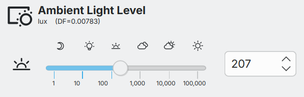
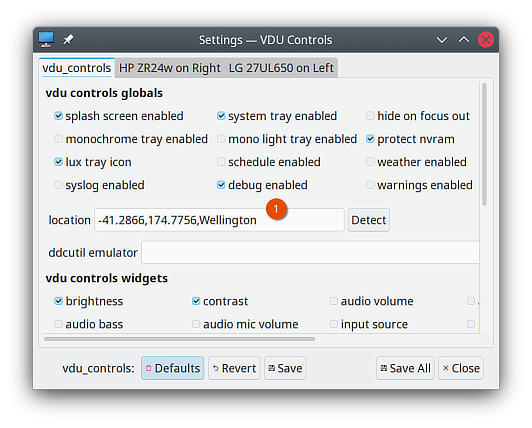
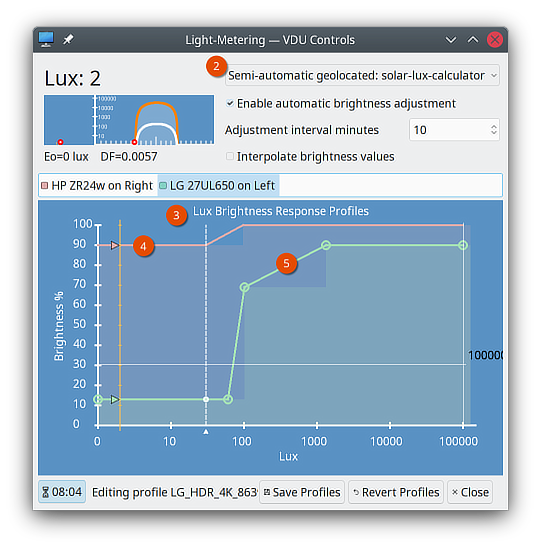
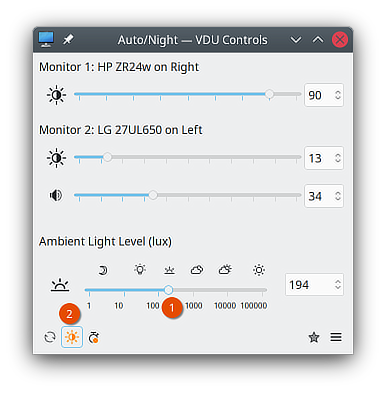
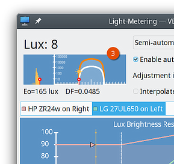

# Semi-Automatic Brightness Adjustment by Geolocation

{ width="300" }

In versions 2.4, the _ambient-light-level_ slider has been combined with an estimate 
of local solar-illumination to achieve *semi-automatic brightness control* throughout the 
day. Adjusting the slider sets the ratio between indoor-illumination and outdoor 
solar-illumination - the _Daylight-Factor_ (_DF_). 
Should circumstances change, adjusting the slider updates the ratio.   (Solar-illumination 
is estimated for a  location by using the local date-time to determine sun-angle, and 
from that, estimates for illumination, and air-mass.)  

Each display's brightness is periodically updated by matching the estimated indoor-illumination against each display's custom _lux-brightness-response profile_.    

## How to enable it
1. **Settings Dialog**: set your geographic **location** ➀.

2. **Light Metering Dialog**: check that the light-meter ➁ is set to **Semi-automatic geolocated** (it's normally the default). If you haven't already done so, setup **Lux Brightness Response Profiles** for each display ➂.  Older displays, with weak back lights, can be given relatively flat profiles, perhaps varying from 80% to 100% ④.  Newer displays, with HDR capable back lights, can be given stepper profiles, possibly varying from 10% to 100% ⑤.
 

## How to use it

1. Set the prevailing indoor light level using the _ambient-light-level_ slider ➀.
2. If not already enabled, click the sun icon to enable automatic adjustments ➁.
3. Starting from your chosen level; the application will periodically update _ambient-light-level_ ➀ in proportion to the expected outdoor sunlight (the adjustment period is set in the _Light Metering Dialog_). 
4. If conditions change, adjust the _ambient-light-level_ slider ➀ to establish a new ratio of indoor to outdoor illumination.

The _Light Metering Dialog_ live plots the current indoor and outdoor (Eo) illumination estimates ➂, 
along with the set Daylight-Factor.

A Daylight-Factor value can optionally be saved in a Preset.  For example, you could use the
_Preset Dialog_ to set up _Cloudy-DF_
and _Sunny-DF_ Presets.  The DF can be the only thing in a preset, you need not include
any display controls or features. 
