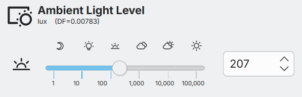
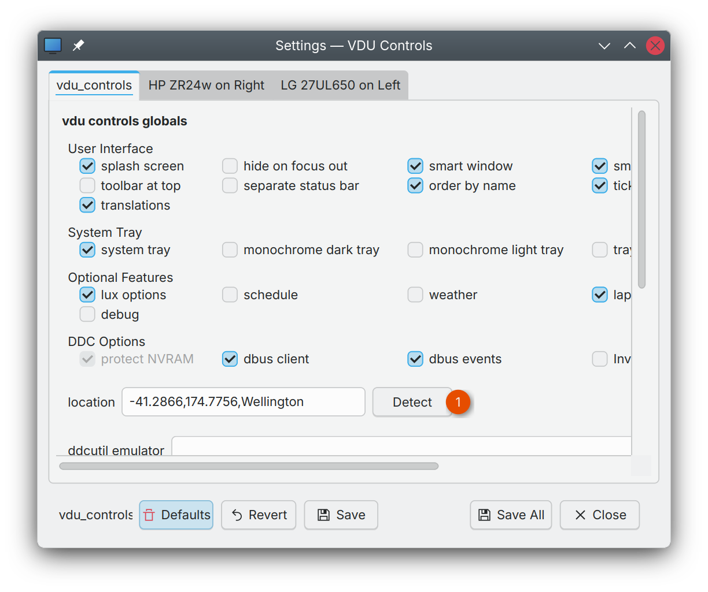
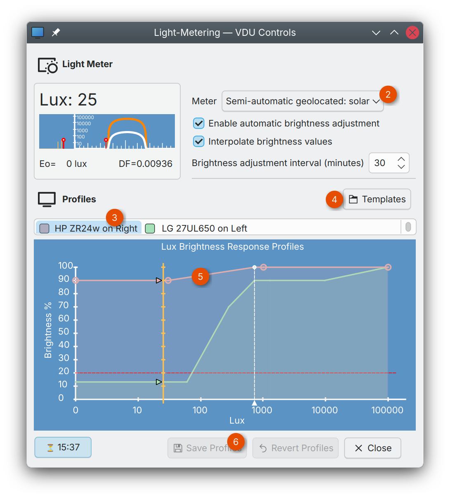
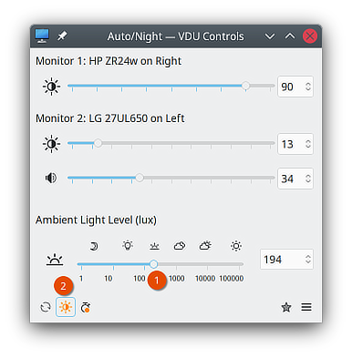
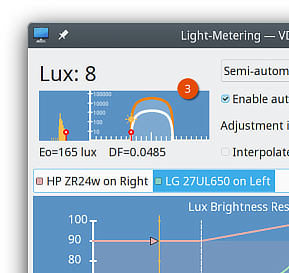

# Semi-Automatic Brightness Adjustment for your Geolocation

{ width="300" }

In version 2.4, the _ambient-light-level_ slider has been combined with an estimate 
of solar-illumination to achieve *semi-automatic brightness control* throughout the 
day. 

Adjusting the slider sets the ratio between indoor-illumination and outdoor 
solar-illumination - the _Daylight-Factor_ (_DF_). 

Should circumstances change, adjusting the slider updates the ratio.   (Solar-illumination 
is estimated for a  location by using the local date-time to determine sun-angle, and 
from that, estimates for illumination, and air-mass.)  

Each display's brightness is periodically updated by matching the estimated indoor-illumination against each display's custom _lux-brightness-response profile_.    

## How to enable it
1. **Settings Dialog**: set your geographic **location**  by using the _Detect_ button &#x2460;.

 
2. **Light Metering Dialog**: set the light-meter  to **Semi-automatic geolocated** &#x2461;.
3. Setup **Profile** for each display:
   1. Pick a display &#x2462; .
   2. Start by choosing a template &#x2463;.
   3. Optionally adjust the curve by clicking on it to add and remove points &#x2464;
   4. Save the profiles &#x2465;
   5. Repeat for each display.

Older displays usually have quite limited backlights, their effective operating brightness 
might vary from 80% to 100%.  From night to day, they often work best with a fairly flat 
and high profile. (The power-supplies in some old displays may generate an audible whine
when brightness is turned below 80%.)

Newer displays, with HDR capable backlights have very wide effective ranges, possible 10% to 100%.
From night to day, they often require a steep profile varying across the full
range from 10% to 100%.

## How to use it

1. Set the prevailing indoor light level using the _ambient-light-level_ slider &#x2460;.
2. If not already enabled, click the sun icon to enable automatic adjustments &#x2461;.
3. Based on the set profiles, the application will periodically 
adjust each displays brightness according to the predicted _ambient-light-level_.
4. If conditions change, adjust the _ambient-light-level_ slider &#x2460; to establish 
a new Daylight-Factor (DF).

The _Light Metering Dialog_ live plots the illumination 
estimates, including the computed indoor __Lux__, the estimated outdoor lux __Eo__, and the
Daylight-Factor __DF__. &#x2462;

!!! TIP "tip"
    The _Preset Dialog_ can be used to save a Daylight-Factor (DF) in a Preset.  For example, 
    you could set up _Cloudy-DF_ and _Sunny-DF_ Presets.  (The DF can be the only thing in a 
    preset, you need not include any display controls or features.) 
